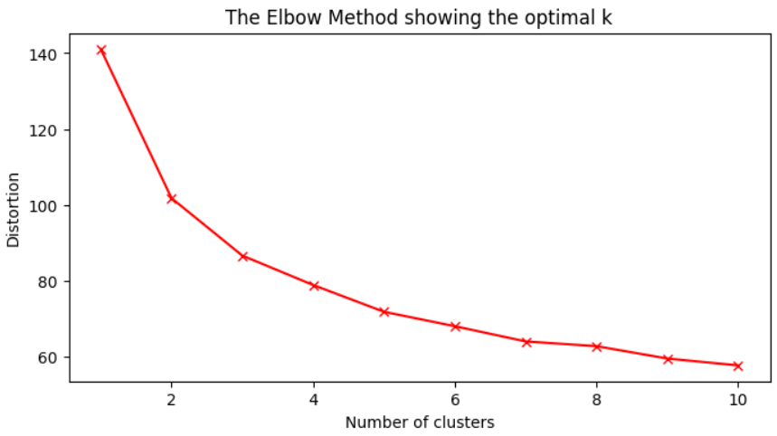
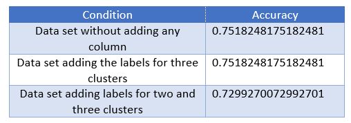
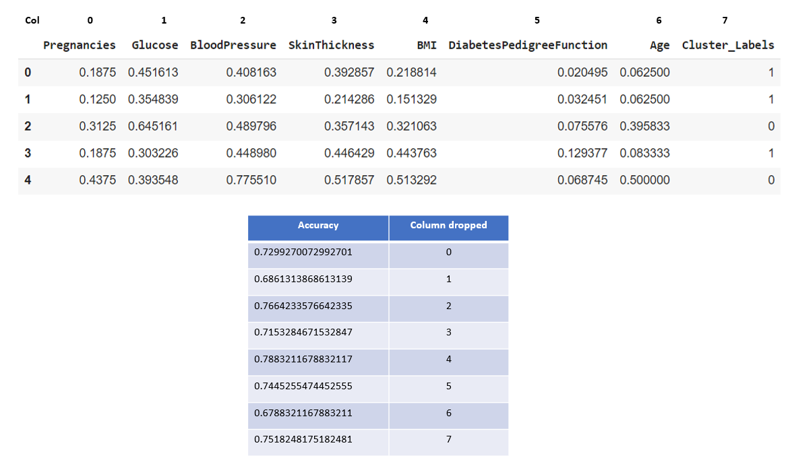
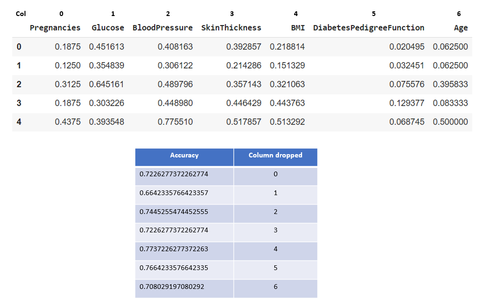

# Clustering

## Table of Contents
  - [Objective](#objective)
  - [Dataset](#dataset)
  - [Tools](#tools)
  - [Methodology](#methodology)
  - [Conclusion](#Conclusion)

## Objective

The project's primary goal is to examine an advanced machine learning technique that employs clustering in order to analyze data structures and as a preparation tool for forecasting whether a patient has diabetes,
based on certain diagnostic measurements included in the dataset. The particular aim is to determine if integrating cluster labels to models for classification as fresh data inputs can improve accuracy for prediction.

## Dataset

The diabetes dataset (https://www.kaggle.com/datasets/akshaydattatraykhare/diabetes-dataset) contains the following key features:
- Pregnancies: Number of pregnancies
- Glucose: Glucose level in blood
- BloodPressure: Blood pressure measurement
- SkinThickness: Thickness of the skin
- Insulin: Insulin level in blood
- BMI: Body mass index
- DiabetesPedigreeFunction: Diabetes percentage
- Age: Age
- Outcome: Final result 1 is Yes and 0 is No
  
## Tools

- Python libraries
  - pandas for data manipulation
  - numpy for numerical analysis
  - matplotlib for data visualization
  - sklearn for machine learning

## Methodology

[Python Code](https://github.com/galaes/Clustering/blob/9d42d46d727f3afe2deb5a75ac8bf16a3bd99c47/Clustering.ipynb)

### 1. Data Collection

- Gather the dataset that contains the information about the diabetes diasease (700 rows)


### 2. Data Preprocesing
- Replace 0 and empty spaces with NaN except the column "Outcome"
- Handle missing data:
  - A row will be removed whether there are more than four missing values.
  - A column will be removed if more than 40% missing values are missing.
  - For other cases, the missing values will be replaced with the median
- Normalize the data

```python
#dealing with the missing values:
#Calculate limit for missing values in columns
column_limit = len(data) * 0.6

#Drop rows with 4 or more missing values
cleaned_data = data.dropna(thresh=len(data.columns) - 3)

# Eliminate columns with more than 40% missing values
cleaned_data = cleaned_data.dropna(axis=1, thresh=column_limit)

# Replace missing values in remaining columns with median
for column in cleaned_data.columns:
  median = cleaned_data[column].median()
  cleaned_data[column].fillna(median, inplace=True)

#Assign the inputs to a variable x and normalize the data
X = cleaned_data.drop(columns=["Outcome"])
X = (X - X.min()) / (X.max() - X.min())
y = cleaned_data["Outcome"]
```

### 3. Clustering Analysis
- Find the ideal number of clusters using the Elbow Method to improve the accuracy of the classification model.

``` python
#create the number of clusters:
K = range(1,11)

#create an empty list where we'll store the wcss calculated for each cluster
wcss_list = []

#create the loop to the different numbers of clusters
for k in K:
  kmeans = KMeans(n_clusters = k, random_state=20, n_init="auto")
  kmeans.fit(X)
  #calculate WCSS and add to the list "wcss_list"
  wcss_list.append(kmeans.inertia_)

#visualize the elbow method
#size of the graphic
plt.figure(figsize=(8,4))
#x, y and color and lines to the graphic(bx-)
plt.plot(K,wcss_list,'rx-')
plt.xlabel("Number of clusters")
plt.ylabel("Distortion")
plt.title("The Elbow Method showing the optimal k")
plt.show()
```



- The optimal number of clusters for this data set is three, which could also be considered an optimal value.

### 4. Clasification Model

- First, it will be constructed without adding the clusters' labels and evaluated with the accuracy score. Then, add the labels to three clusters and see if the model's accuracy increases.



- These results demonstrate that the accuracy of test evaluation is relatively high. However, with more columns, the accuracy's value does not increase but is the same. Whether adding another cluster label to the data set, just for experimenting, the accuracy even decreases.
- Now, Backward Elimination will determine if we can increase the accuracy of the classification model even more. As shown in the next figures, the accuracy of the model increases when column four is dropped for both data sets without adding columns, and the data set adds the labels of three clusters:





- As observed, accuracy increases in both cases if column four, "BMI," is dropped, even if there is a slight increase with respect to the data set with the cluster’s labels. 

## Conclusion

- The project showed that adding cluster labels to the data set did not mean a notable increase in the classification model's accuracy since the results for both the one that did not contain any added column and that had been added the cluster labels were the same. This outcome could be related to the cluster evaluation through v-measure, which resulted in a fairly low value, which means that the clustering does not satisfy homogeneity or completeness. However, an increase in accuracy is seen when performing the backward elimination. When deleting the feature column "BMI," that value improves the value to 0.78 from 0.75, which was obtained with the data set without performing any action. Therefore, by adding a cluster label to the data set and maintaining only the features that improve the accuracy, the classification model will enhance its performance. 
