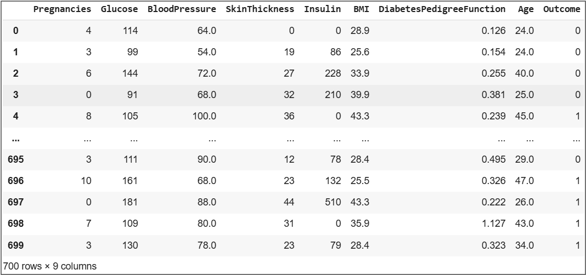

# Clustering

## Table of Contents
  - [Objective](#objective)
  - [Dataset](#dataset)
  - [Tools](#tools)
  - [Methodology](#methodology)
  - [Key Achievements](#key-achievements)

## Objective

The project's primary goal is to examine an advanced machine learning technique that employs clustering in order to analyze data structures and as a preparation tool for forecasting whether a patient has diabetes,
based on certain diagnostic measurements included in the dataset. The particular aim is to determine if integrating cluster labels to models for classification as fresh data inputs can improve accuracy for prediction.

## Dataset

The diabetes dataset (https://www.kaggle.com/datasets/akshaydattatraykhare/diabetes-dataset) contains the following key features:
- Pregnancies: Number of pregnancies
- Glucose: Glucose level in blood
- BloodPressure: Blood pressure measurement
- SkinThickness: Thickness of the skin
- Insulin: Insulin level in blood
- BMI: Body mass index
- DiabetesPedigreeFunction: Diabetes percentage
- Age: Age
- Outcome: Final result 1 is Yes and 0 is No
  
## Tools

- Python libraries
  - pandas for data manipulation
  - numpy for numerical analysis
  - matplotlib for data visualization
  - sklearn for machine learning

## Methodology

[Python Code](https://github.com/galaes/Clustering/blob/9d42d46d727f3afe2deb5a75ac8bf16a3bd99c47/Clustering.ipynb)

### 1. Data Collection

- Gather the dataset that contains the information about the diabetes diasease (700 rows)


### 2. Data Preprocesing
- Replace 0 and empty spaces with NaN except the column "Outcome"
- Handle missing data:
  - A row will be removed whether there are more than four missing values.
  - A column will be removed if more than 40% missing values are missing.
  - For other cases, the missing values will be replaced with the median

```python
#replace 0 and empty spaces with NaN except the column "Outcome"
columns_to_replace = ["Pregnancies", "Glucose","BloodPressure","SkinThickness","Insulin","BMI","DiabetesPedigreeFunction","Age"]
data[columns_to_replace] = data[columns_to_replace].replace({" ":np.nan, 0:np.nan})

#dealing with the missing values:
#Calculate limit for missing values in columns
column_limit = len(data) * 0.6

#Drop rows with 4 or more missing values
cleaned_data = data.dropna(thresh=len(data.columns) - 3)

# Eliminate columns with more than 40% missing values
cleaned_data = cleaned_data.dropna(axis=1, thresh=column_limit)

# Replace missing values in remaining columns with median
for column in cleaned_data.columns:
  median = cleaned_data[column].median()
  cleaned_data[column].fillna(median, inplace=True)
```

### 3. 

### 4. Insights and Findings

### Key Achievements
